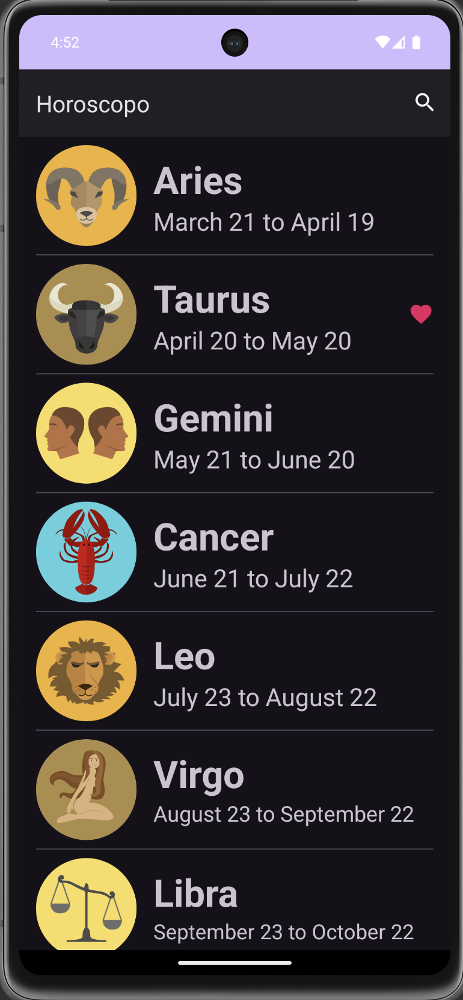
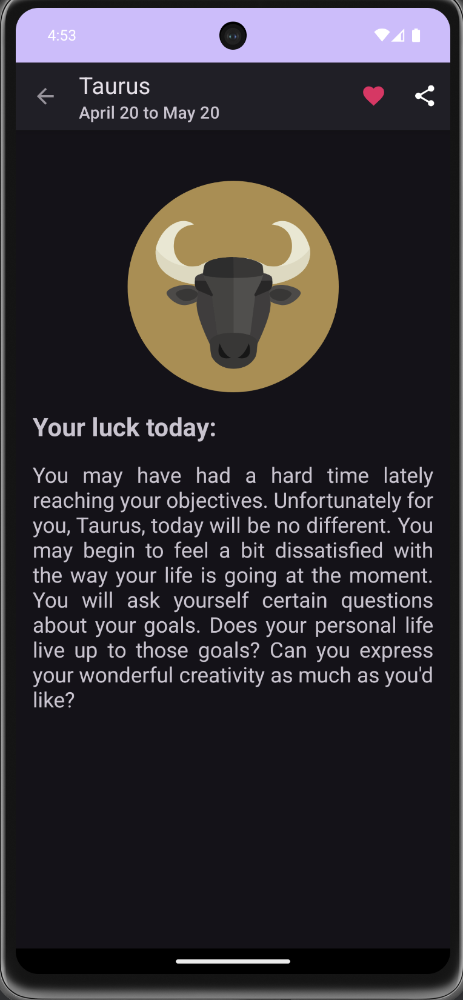

# Horóscopo

Primer proyecto de prueba, en el que se crea una aplicación Android que muestra los signos zodiacales, los cuales son tomados de forma dinámica consumiendo una API.

## Imágenes

## Práctica:

 - Desarrollo de una APP
 - Consumir una API
 - Manejo de la Sesión

## Tech Stack

**Utilizando:** Android Studio, Kotlin.

